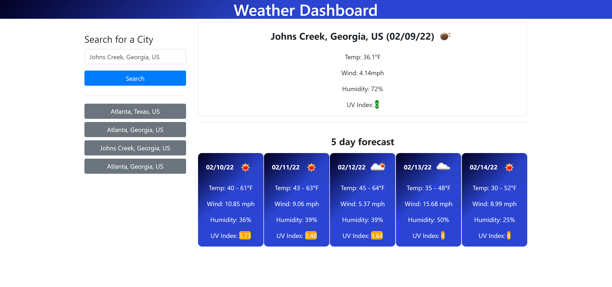

# Weather-Dashboard

## Description
This is a weather dashboard application that allows the user to get weather data by typing in the city name. The current weather and 5 day forecast will be shown on the page.

## Deployed GitHub Page
[Weather Dashboard](https://xuyangzhang0.github.io/Work_Day_Scheduler/)

## Screenshot

## How it works
First the user will search by city name, and in the backend, there is a GeoCoding API call made to get the lat, lon of the city, and because there could be multiple cities with the name of Atlanta, I am returning top5 results, and allow the user to choose the one they wanted to see. Upon selecting the city of their choice, there is an API call made against OpenWeather, using what they called One Call API, with the current weather and next 7 day forecast, I then parse the data and render on the page.

